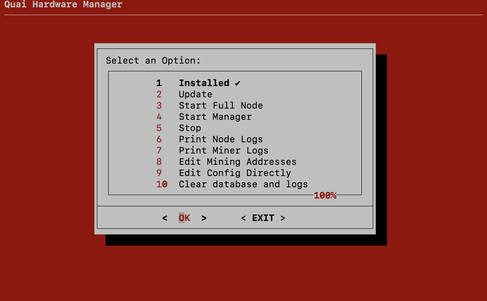

# quai-node-cli-tool

A simple, CLI interface for everything related to your Quai Network node and manager. Easily install, update, and manage all of your Quai Network programs in a central location. This repo inclues the following programs:

- `quai.sh`: A low level CLI interface that provides basic functionality.
- `quai-admin.sh`: A higher level CLI interface that offers more advanced functionality.

This repository is a work in progress and is made purely to simplify the interaction with your Quai Network node and manager. Please report any issues you encounter in our [discord](https://discord.gg/quai).

### Dependencies

- Quai Network node and manager [installation dependencies](https://docs.quai.network/develop/installation)
- Your favorite Unix package manager (e.g. `apt`, `yum`, `brew`, etc.)
- [Dialog](https://invisible-island.net/dialog/#synopsis)

### Installation

- Clone this repository
- Install dependencies
- dialog can be installed using your favorite package manager
  - `sudo apt install dialog` (Ubuntu)
  - `sudo yum install dialog` (CentOS)
  - `brew install dialog` (MacOS)

## Executing Program

Open up a terminal window and navigate to the directory where you cloned the repo. To run the base script, run the following command:

```
sh quai.sh
```

The base script interface will look like this:



To run the advanced script, run the following command:

```
sh quai-admin.sh
```

The advanced script interface will look like this:


## Usage

For first time users, choose install. This will install the necessary dependencies and build the node and manager. Once the installation is complete, you can choose to run, update or stop the node or manager and check their logs. The advanced script also allows you to clear the node db, logs, and directly edit the config file.

## Acknowledgements

Special thanks to [dm-paull](https://github.com/dm-paull) for his contribution to this script.
